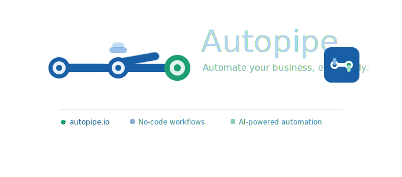

  

### What is Autopipe?
**Autopipe** is a visual workflow automation platform that lets you connect your favorite apps and automate repetitive tasks — without writing a single line of code.

Built around an intuitive drag-and-drop canvas, Autopipe lets you create automation pipelines by linking triggers, actions, and integrations. Need more power? Drop in AI steps powered by OpenAI or Claude and let intelligence handle the logic.

Think of it as your own automation layer — faster and more affordable than Zapier, more approachable than n8n.

 
 
 

### Features
 
- 🎨 **Visual canvas** — drag-and-drop workflow builder with real-time preview
- ⚡ **Multiple triggers** — webhooks, schedules, form submissions, and app events
- 🤖 **AI-powered steps** — native integrations with OpenAI and Claude
- 🔌 **App integrations** — Gmail, Slack, Notion, Stripe, Google Sheets, and more
- 🔁 **Background execution** — robust job queue system for reliable workflow runs
- 📊 **Real-time monitoring** — execution logs, error tracking, and status dashboard
- 🔐 **Authentication** — secure user accounts with role-based access
- 💳 **Subscription plans** — Free, Pro, and Team tiers powered by Stripe
- 🚧 **Paywalls & usage limits** — built-in billing gates per plan

 
 
 
 

### Tech Stack
 
| Layer | Technology |
|---|---|
| Framework | Next.js  (App Router) |
| Language | TypeScript |
| Database | PostgreSQL + Prisma ORM |
| Auth | Clerk |
| Payments | Stripe |
| Job Queue | Inngest |
| AI | OpenAI SDK / Anthropic SDK |
| Styling | Tailwind CSS |
| Error Tracking | Sentry |
| Deployment | Vercel |
 
 
 
 

### Roadmap
 
- [x] Project setup & authentication
- [x] Visual canvas (drag-and-drop)
- [x] Workflow triggers & actions
- [x] AI integrations (OpenAI / Claude)
- [x] Background job execution
- [x] Subscription & billing (Stripe)
- [ ] More app integrations
- [ ] Team workspaces
- [ ] Workflow templates marketplace
- [ ] Analytics dashboard
